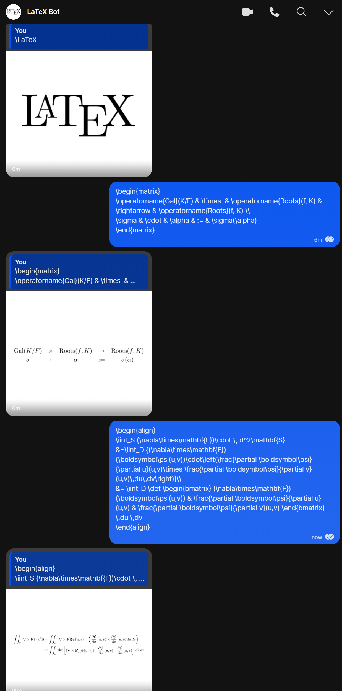

# Signal LaTeX bot

A Signal bot that replies to incoming messages with LaTeX PNGs via
[JLaTeXMath](https://github.com/opencollab/jlatexmath).

Try it out by messaging +14046091473 on Signal (https://signal.me/#p/+14046091473).

The bot can also be added to group chats (you'll have to add the bot to contacts first), where it will generate LaTeX
PNGs only for messages started with `!latex`, `!tex`, `/latex`, or `/tex`.



### Installation

These are installations for a Debian-based installation.

Add an `.env` file containing the following:

```plain
DEPLOY_REMOTE=root@<IP or hostname of server to host the bot>
```

As root on a server, run the following:

```bash
# Run these three lines if you haven't installed signald already.
echo "deb https://updates.signald.org unstable main" > /etc/apt/sources.list.d/signald.list
curl https://updates.signald.org/apt-signing-key.asc | apt-key add -
apt update && apt install -y signald

useradd -m -s /bin/bash -g signald -b /var/lib signallatexbot
mkdir -p /opt/signallatexbot/deploy /opt/signallatexbot/images
chown signallatexbot /opt/signallatexbot/images
```

Ensure you have an account registered with signald already. Then, we will need to generate the bot configuration. On
your local machine, build the bot with `./gradlew installDist`. After that, run
`build/install/signal-latex-bot/bin/signal-latex-bot update-config --local` and follow the prompts. Use
`/opt/signallatexbot/images` for the output photo directory.

Then, upload the resulting `config.json` file to `/var/lib/signallatexbot` and ensure that it is owned by the
`signallatexbot` user.

Copy [`signallatexbot.service`](./signallatexbot.service) to `/etc/systemd/system/signallatexbot.service`

Then on your local machine, run

```bash
./deploy-bot.sh
```

Finally, to ensure the bot starts on boot, run on the server, as root:

```bash
systemctl enable signallatexbot
```

You can run the following on the server as root to configure the bot's profile:

```bash
# Be the bot
su - signallatexbot
/opt/signallatexbot/deploy/bin/signal-latex-bot update-profile
```
